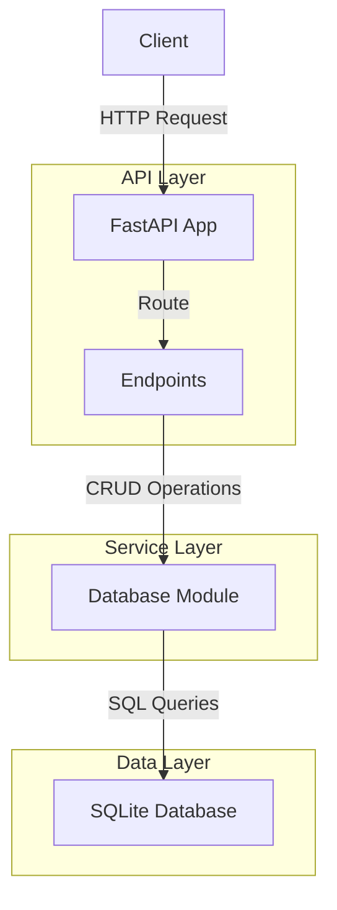
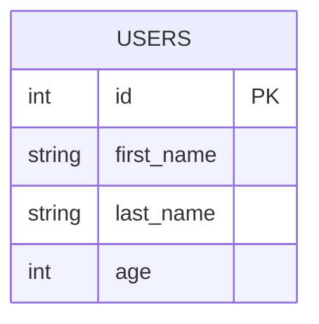
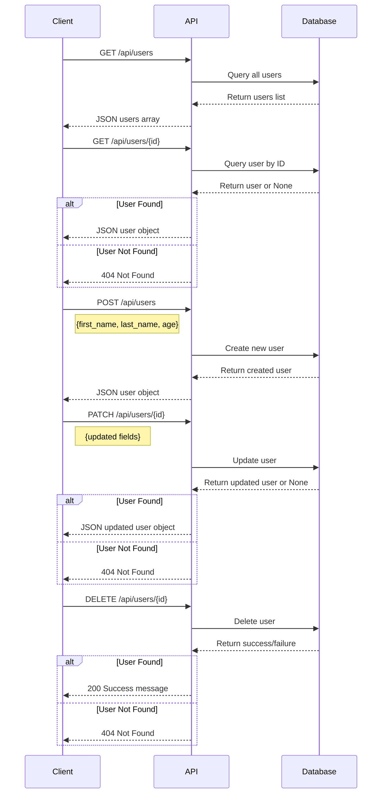
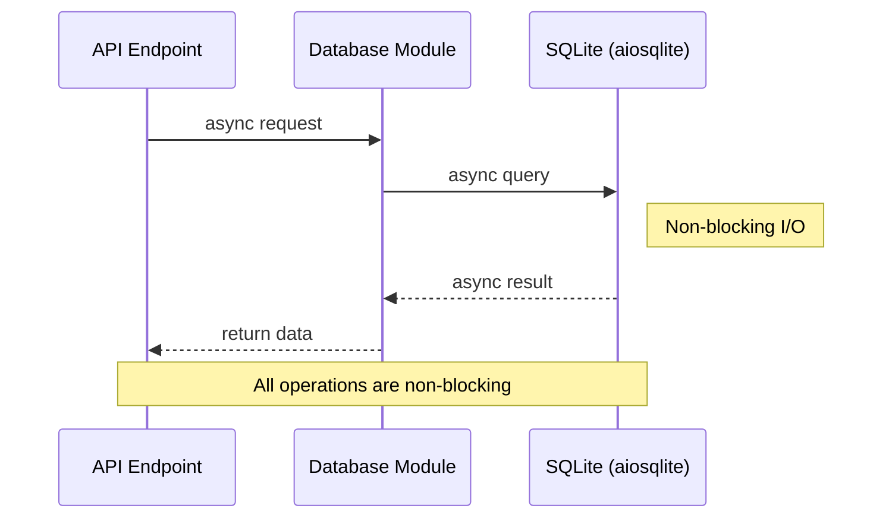

# Cursor Demo API Architecture

This document describes the architecture of the Cursor Demo API.

## Application Structure

The application follows a layered architecture with the following components:

- **API Layer**: FastAPI application with REST endpoints
- **Service Layer**: Business logic and data access
- **Data Layer**: SQLModel models and database access

### Directory Structure

```
project/
├── db/                 # Database files
├── src/                # Source code
│   ├── endpoints/      # API endpoints
│   ├── models.py       # Data models
│   ├── database.py     # Database access
│   └── main.py         # FastAPI application
├── main.py             # Entry point
└── ...
```

## Component Diagram



## Database Schema



## API Endpoints

### User Endpoints



## Async Implementation

The application uses async/await pattern throughout the codebase:

- Async SQLModel for database operations using aiosqlite
- FastAPI async endpoints for non-blocking request handling
- Dependency injection for database session management



The async implementation allows for efficient handling of concurrent requests, making the application more scalable.

## Testing Strategy

Tests are implemented using pytest and pytest-asyncio:

- Unit tests for database CRUD operations
- Async fixtures for database session management
- In-memory SQLite database for testing