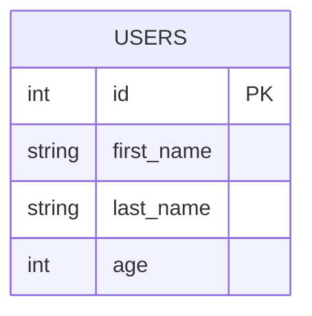
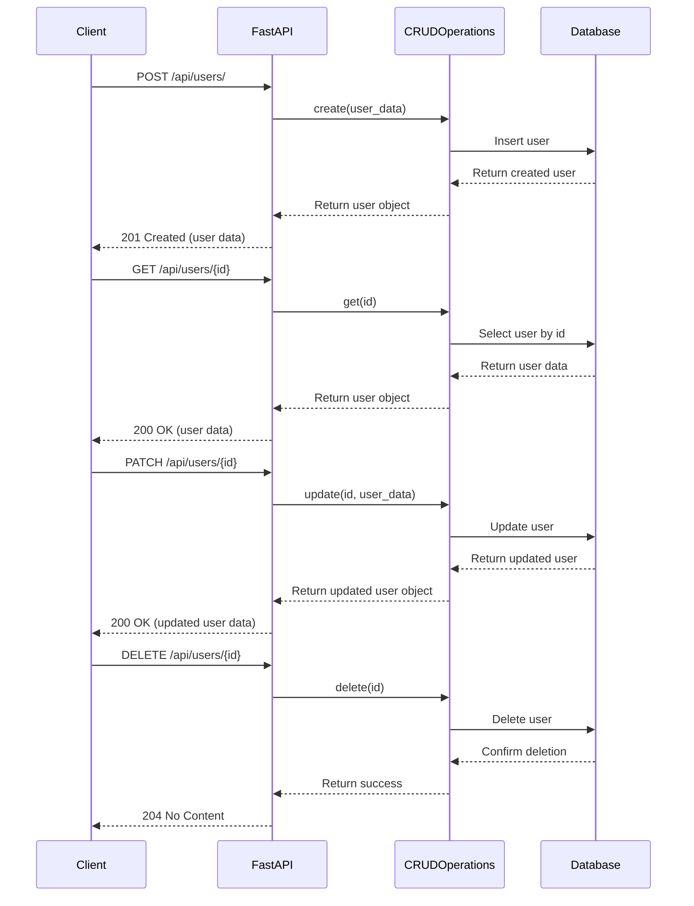

# Cursor Demo Application Architecture

This document describes the architecture of the Cursor Demo application, a FastAPI-based API with async SQLite database access.

## Overview

The application follows a layered architecture with the following components:
- **API Layer**: FastAPI application with endpoints for CRUD operations
- **Service Layer**: Business logic (when needed)
- **Data Access Layer**: Database operations using SQLModel and aiosqlite

## Component Diagram

```mermaid
flowchart LR
    A[FastAPI Application] <--> B[SQLModel Models/CRUD]
    B <--> C[SQLite DB\n(aiosqlite)]
```

## Project Structure

```mermaid
graph TD
    project[/project]
    db[/db]
    src[/src]
    endpoints[/endpoints]
    init[__init__.py]
    users[users.py]
    main[main.py]
    database[database.py]

    project --> db
    project --> src
    project --> database
    src --> endpoints
    src --> main
    endpoints --> init
    endpoints --> users
    db --> cursor_demo[cursor_demo.db]
```

## Database Schema



## API Endpoints Sequence Diagram



## Async Implementation

The application uses async/await throughout the stack:
- FastAPI endpoints are defined as async functions
- SQLModel operations use the async SQLAlchemy engine
- The database connection uses aiosqlite for async operations

This allows for efficient handling of concurrent requests and improved performance.